# Лаба 1(k8s)

### Проверка установленного окружения:
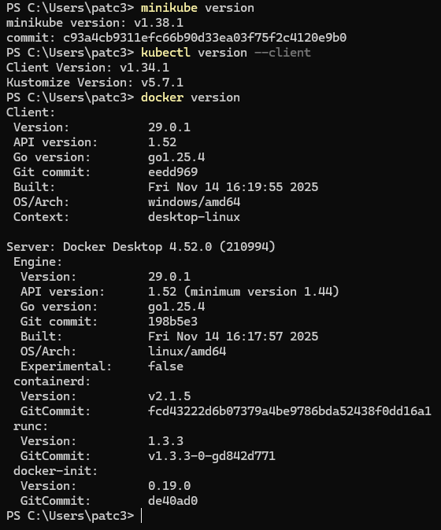

### Сборка приложения

На данном этапе выполняется сборка Java-приложения с использованием Maven. В результате формируется исполняемый JAR-файл, который будет использоваться для последующей контейнеризации.

```
mvn clean package
```
### Создаем Dockerfile:
```
FROM eclipse-temurin:21-jdk

WORKDIR /app

COPY target/*.jar app.jar

EXPOSE 8080

ENTRYPOINT ["java", "-jar", "app.jar"]
```
### Настройка окружения Minikube

Выполняется настройка использования Docker-демона внутри Minikube, 
что позволяет собирать образы непосредственно в кластере.
```
minikube docker-env --shell powershell | Invoke-Expression
```

### Сборка Docker-образа
```
docker build -t my-app:1.0 .
```
Проверка созданного образа:
```
docker images
```
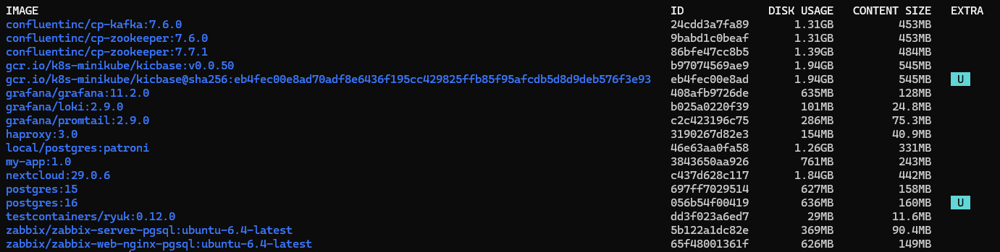

### Создание Deployment

На данном этапе создаётся объект Deployment, 
отвечающий за запуск и масштабирование приложения в Kubernetes.

```
apiVersion: apps/v1
kind: Deployment
metadata:
  name: my-app
spec:
  replicas: 3
  selector:
    matchLabels:
      app: my-app

  template:
    metadata:
      labels:
        app: my-app

    spec:
      containers:
        - name: my-app
          image: my-app:1.0
          imagePullPolicy: Never

          ports:
            - containerPort: 8080

          resources:
            requests:
              cpu: "100m"
            limits:
              cpu: "500m"
```

### Применение конфигурации:
```
kubectl apply -f deployment.yaml
```

### Создание Service

Для обеспечения доступа к приложению был создан объект Service

```
apiVersion: v1
kind: Service
metadata:
  name: my-app-service

spec:
  type: NodePort

  selector:
    app: my-app

  ports:
    - port: 80
      targetPort: 8080
      nodePort: 30007
```

### Применение конфигурации:
```
kubectl apply -f service.yaml
```
### Проверка доступности приложения

Для проверки доступности приложения использовалась команда открытия сервиса Minikube.
```
minikube service my-app-service
```
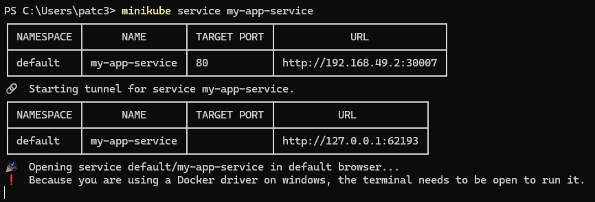

### Установка Metrics Server

Для сбора метрик о загрузке ресурсов в кластере был установлен Metrics Server
```
kubectl apply -f https://github.com/kubernetes-sigs/metrics-server/releases/latest/download/components.yaml
```
### Открываем 
```
kubectl edit deployment metrics-server -n kube-system
```
### В 'args:' добавляем строчку
```
- --kubelet-insecure-tls
```


### После установки проверяется корректность работы Metrics Server с использованием команды:
```
kubectl top pods
```

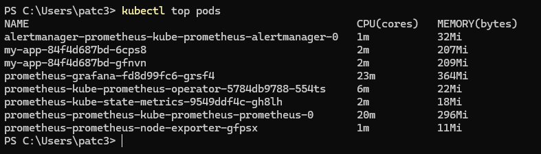

### Настройка автоматического масштабирования (HPA)

Был настроен Horizontal Pod Autoscaler для автоматического масштабирования подов в зависимости от загрузки CPU.
```
kubectl autoscale deployment my-app --cpu-percent=50 --min=2 --max=5
```
Проверка состояния HPA:
```
kubectl get hpa
```
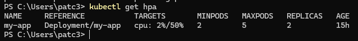

### Генерация нагрузки
#### Создаём контейнер:
```
kubectl run -i --tty load-generator --rm --image=busybox /bin/sh
```
#### Внутри:
```
while true; do wget -q -O- http://my-app-service; done
```

### Следим за scaling
```
kubectl get hpa -w
```
И
```
kubectl get pods -w
```

#### В результате увеличения нагрузки происходит автоматическое масштабирование количества Pod-ов:
https://youtu.be/lPqwnIKwmKw
### Установка Helm
Для управления пакетами Kubernetes был установлен Helm.

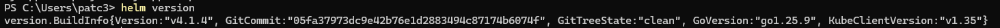
### Добавляем репозиторий
```
helm repo add prometheus-community https://prometheus-community.github.io/helm-charts
```
#### Обновляем
```
helm repo update
```

### Установка мониторингового стека

С использованием Helm был развернут стек мониторинга kube-prometheus-stack.
```
helm install prometheus prometheus-community/kube-prometheus-stack
```
### Проверка pod
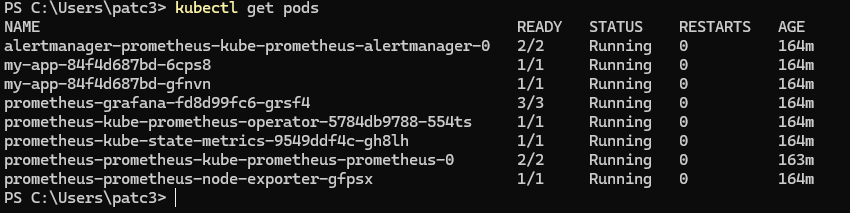


### Настройка Grafana

После установки мониторингового стека выполняется 
получение учетных данных и вход в Grafana.
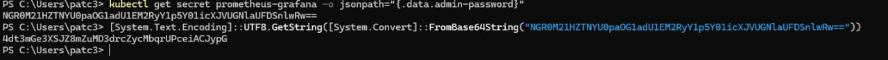

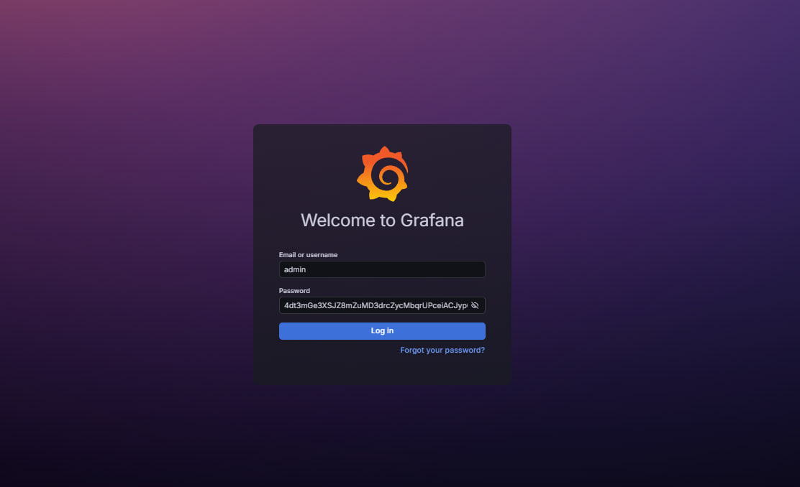
### Импортируем готовый dashboard 1860 по инструкции:

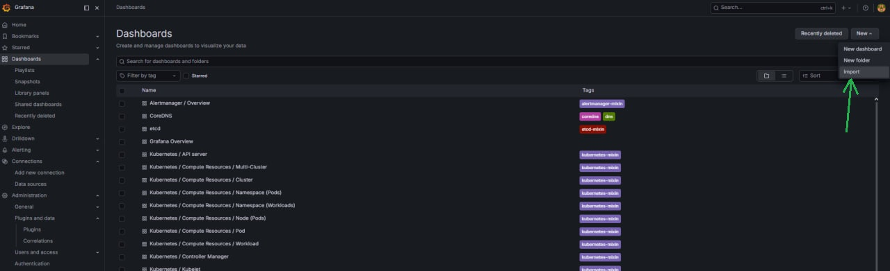

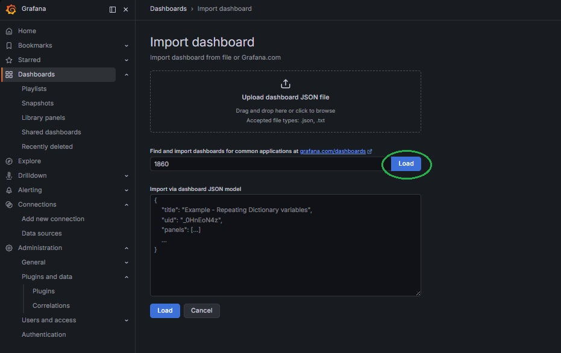

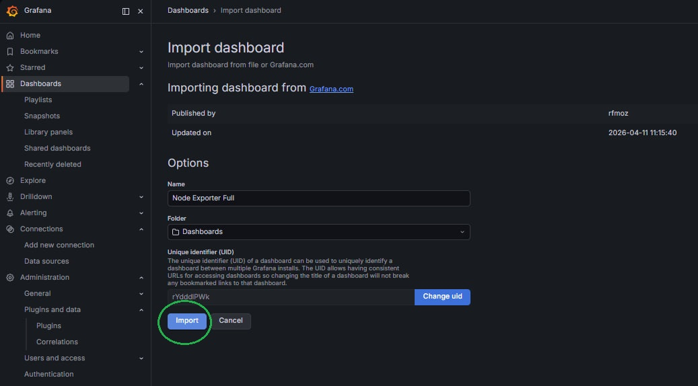

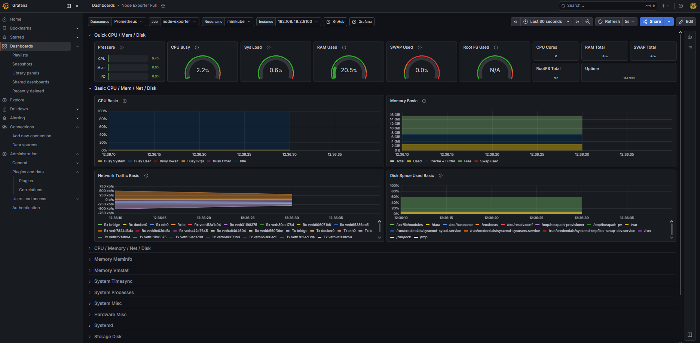
В систему был импортирован готовый dashboard для мониторинга состояния кластера.

### Делаем нагрузку:
https://youtu.be/0PhWQ2YkNTU